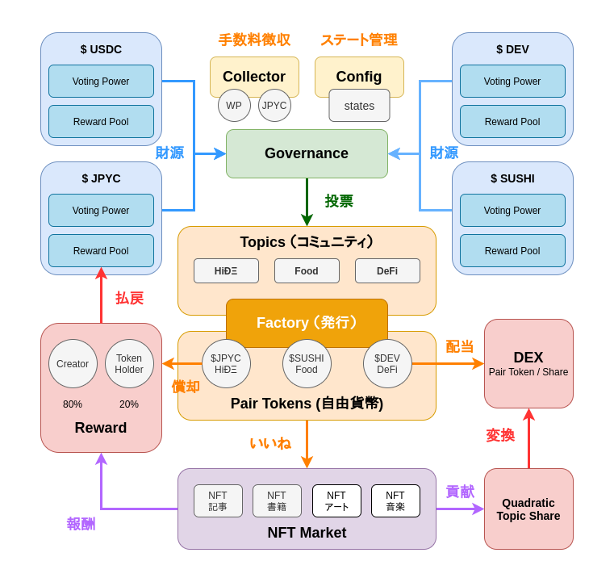

# HiÐΞ Protocol

HiÐΞ Protocol is a DAO protocol for sustainable NFT rewards on Ethereum blockchain.

## Contract Addresses

- WP (ERC20): [0xc8c0b377f9f164bdb008c0e9fa57a3d9da2dabcd](https://polygonscan.com/address/0xc8c0b377f9f164bdb008c0e9fa57a3d9da2dabcd)
- HIDETOPICS (ERC721): [0x8e0A0c9B284ecA398963C6AD557894B8019D1349](https://polygonscan.com/address/0x8e0A0c9B284ecA398963C6AD557894B8019D1349)
- Storage: [0x079797b28e07f56f715e6b1b97A50c49661ee940](https://polygonscan.com/address/0x079797b28e07f56f715e6b1b97A50c49661ee940)
- Config: [0x8e855Fe8966698543697D5Cd0793e558917E67AE](https://polygonscan.com/address/0x8e855Fe8966698543697D5Cd0793e558917E67AE)
- Collector: [0x90a5F6BCE49afDC3754508ADABf84Fe80678EdA7](https://polygonscan.com/address/0x90a5F6BCE49afDC3754508ADABf84Fe80678EdA7)
- Governance: [0xD236Ef052807f351d203500eD7Ab1dbcCb50BB87](https://polygonscan.com/address/0xD236Ef052807f351d203500eD7Ab1dbcCb50BB87)
- Factory: [0xa08D17Fc989792f8190c56340FFdf064502e1821](https://polygonscan.com/address/0xa08D17Fc989792f8190c56340FFdf064502e1821)
